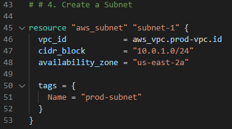

# Terraform Demo

# Introduction & Goals
- The goal of the project was to use infrastructure-as-Code to create an ec2 instance, deploy on custom VPC on custom subnet, use a public IP address to ssh into the server, and setup a webserver to handle web traffic.

# Application
- "Terraform is an open-source infrastructure as code software tool created by HashiCorp. Users define and provision data center infrastructure using a declarative configuration language known as HashiCorp Configuration Language, or optionally JSON"
- I used Visual Studio Code to run the HCL script. To initialize the connection from Visual Studio to AWS, run 'terraform init'

# Script
- Connect to AWS using by selecting your region and access keys

- You can find the terraform templates from their website: https://registry.terraform.io/providers/hashicorp/aws/latest/docs/resources/instance
- The first script assigns our VPC name with a CIDR block.

- The second script sets up our internet gateway, named 'gw'.

- The third script is for our custom route table for IPv4 & IPv6 traffic

- The fourth script creates the subnet. Make sure you match the correct availability zone

- The fifth script associates the subnet with the route table

- The sixth script creates our security group. We allow traffic for HTTPS/HTTP  and SSH

- The seventh script creates a network interface with an IP address

- The eighth script creates an elastic IP for our network interface

- The ninth script creates our ubuntu server and automatically runs a bash script to install updates and run apache

# Run Script
- To run script: terraform apply --auto-approve
- To undo deployment: terraform destroy
- If the deployment is successfull, you will see that the EC2 is running on AWS

- You can now ssh into the ubuntu server

# Conclusion
- Terraform allows you to deploy a fully configured server within minutes of running the script. Since Terraform is open-source, it can be used universally on any cloud platform. 
